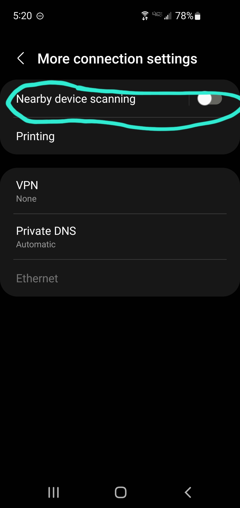
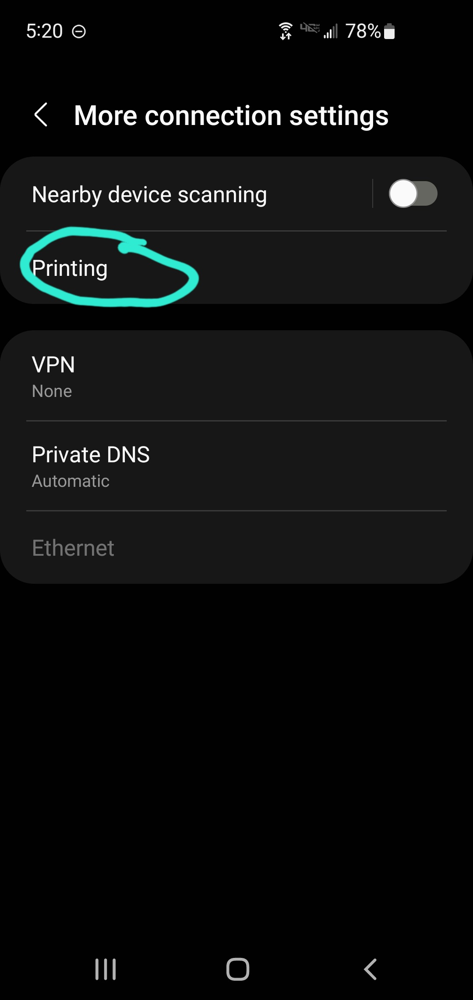
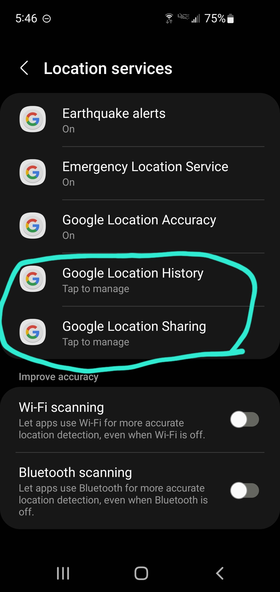

# Tips to extend battery life on Android phone
### Using Samsung Galaxy S10e model
---

Knowing how to squeeze every last drop out of your phone may save you when your battery is at 5% and you need to make an important phone call. But it’s also good to keep these settings on all the time to prevent constantly having to find somewhere to charge your phone throughout the day.

## Settings
To begin, first go to Settings.

## Connections
Go to Connections. Here, you can change how your phone uses data and how it connects to other devices.

- Go to More connection settings. 

- Make sure Nearby device scanning is toggled off. 

- Go to Printing. 

Make sure Default Print Service is toggled off.

## Display
Go back to Settings and scroll down to Display. Here, you can dim the display of your phone. //////////

- Selecting Dark mode will help save battery.

- If you only want Dark mode at night, go to Dark mode settings instead.

 Toggle on Turn on as scheduled, which will allow you to set it to Sunset to sunrise or to Custom Schedule.

 

- Slide the Brightness slider to lower the brightness and save battery. 

You can also do this from the shortcut, found by sliding down twice from the top of the display.

- Scroll down to go to Screen timeout. 

Select a lower time, such as 30 seconds, so the display will turn off sooner.

- Back in Display, scroll down to the bottom and go to Screen saver. 

Make sure None is selected.

## Lock screen
Go back to Settings and scroll down to Lock screen. Here, you can control what your screen shows when it’s locked.

- Toggle Always On Display to off. 

Alternatively, press the Always On Display heading to customize the display. If you only want to display information sometimes, toggle it On and choose Tap to show so the display will only show when you want it to.

## Location
Go back to Settings and scroll down to Location. Here, you can control which apps know your location. ////////
- Go to Location services. ////////

Earthquake alerts, Emergency Location Service, and Google Location Accuracy should read On, while Google Location History and Google Location Sharing should read Tap to manage.

- Toggle off both Wi-Fi scanning and Bluetooth scanning. The more your phone is constantly scanning for nearby devices, the more battery it will use.

## Advanced features
Go back to Settings and scroll down to Advanced features.

- Go to Motions and gestures. 

Toggle off Lift to wake and Keep screen on while viewing.

## Battery and device care
Go back to Settings and scroll down to Battery and device care. //////
- Go to Battery, which shows a detailed graph of your usage from your last charge.

- In Background usage limits, make sure Put unused apps to sleep is toggled on.

- Back in Battery, scroll down to More battery settings and toggle Adaptive battery on. To preserve the overall health of your battery, toggle off both Fast charging and Fast wireless charging and toggle on Protect battery.

## Apps
Go back to Settings and scroll down to Apps. ///////
- Press the 3 dots in the top right corner to go to Special access. 

Scroll down to Usage data access.

Toggle off Digital Wellbeing. While a helpful app, it does track a lot of movement and location information and can use up more battery.

## Software update
Finally, go back to Settings and scroll down to Software update to make sure you have the latest software.

- Check that it says You’re all set! at the bottom. If it doesn’t, go to Check for software updates to install the latest software. 

